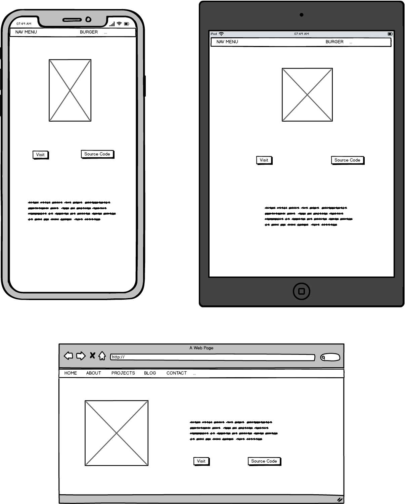
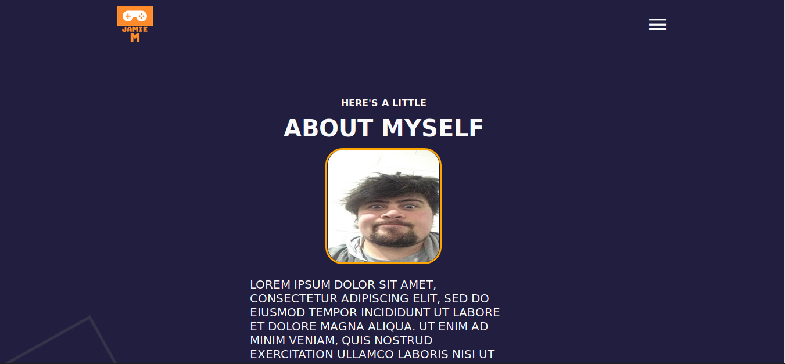

# Jamie Moukatatzakis - Portfolio

## Links 

Deployed Site -> JamieMoukatatzakis.github.io

Github Address -> https://github.com/JamieMoukatatzakis/

Commits + branches can be found here -> https://github.com/JamieMoukatatzakis/portfolio

### Purpose

Purpose of this site is to be the first contact for employers. It's to display my technical skills and hopefully give me exposure. It should offer the employer a little information about me as well as my resume and past experiences.

### Functionality + Features

1. Burger Menu

Site has a burger menu for navigation. It will have a nav bar for desktop in the future. It allows access to all main html pages from any page on the site. The animation is done in JaveScript.

2. Hover over Social Icons

Hovering over social media icons should highlight them orange, displaying they are clickable and working along with the color scheme.

3. Responsive Design

Site was coded to respond to Iphone 6 through to Iphone X as well as standard Ipad resolutions and desktop resolutions greater than 1366px.

4. Accessibility

There is some accessibility currently with the nav and section tags.Blog tags will be added to the blog posts later.

5. Sub Resource Integrity

Is used for the main CSS style sheets and small JavaScript File. Will be added to imported icons later.

### Sitemap

### Basic Wireframes

### Website Pictures

### Target Audience

Potential Employers and Educators

### Tech Stack Used

HTML, CSS, FlexBox, JavaScript

